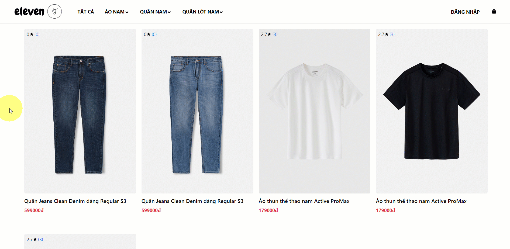
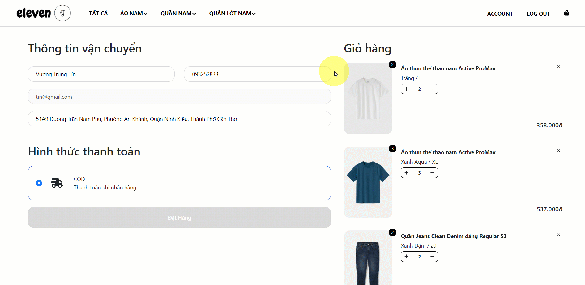
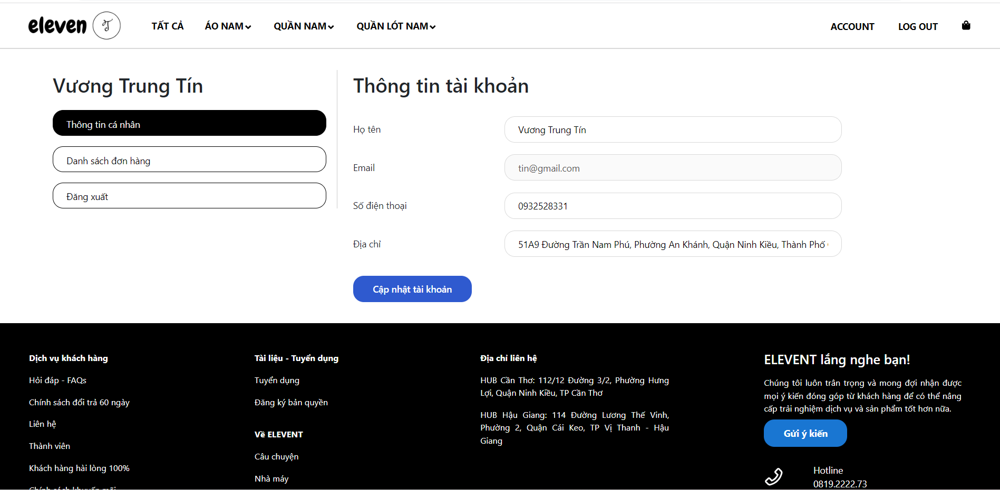
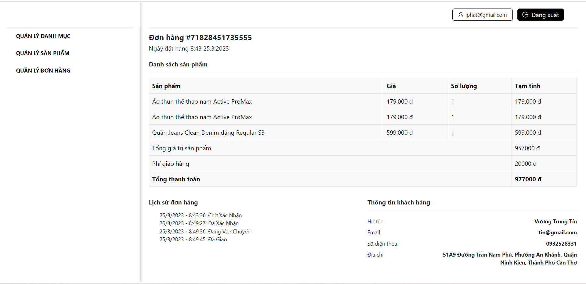
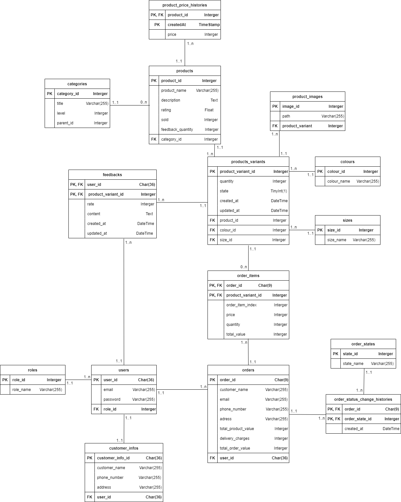

# GIAO DIỆN TRANG BÁN HÀNG
## 1. Trang chủ

## 2. Trang danh sách sản phẩm

## 3. Trang chi tiết sản phẩm

## 4. Trang giỏ hàng

## 5. Trang thông tin khách hàng

## 6. Trang lịch sử đơn hàng

## 7. Trang chi tiết đơn hàng

# GIAO DIỆN TRANG ADMIN
## 1. Trang quản lý danh mục

## 2. Trang quản lý sản phẩm

## 3. Trang thêm sản phẩm

## 4. Trang quản lý đơn hàng

## 5. Trang chi tiết đơn hàng

# THIẾT KẾ DỮ LIỆU - SƠ ĐỒ THỰC THỂ QUAN HỆ

# CHỨC NĂNG
- Quản lý danh mục (Bao gồm: Loại sản phẩm, Màu sắc, Size)
- Quản lý sản phẩm
- Quản lý đơn hàng
- Giỏ hàng
- Xem lịch sử đơn hàng
- Đánh giá sản phẩm

# CÔNG NGHỆ SỬ DỤNG
- Backend: NodeJS (Express)
- Frontend: NextJS
- DBMS: MySQL
